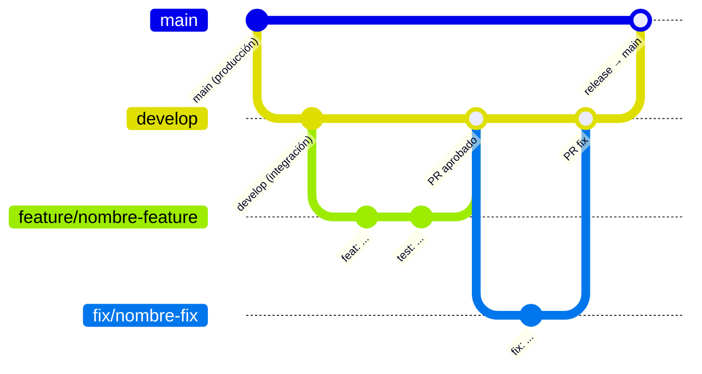
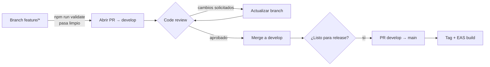

# Contributing — Pokédex App

Guía técnica para desarrolladores que van a trabajar en el proyecto.

---

## Índice

1. [Configuración del entorno](#1-configuración-del-entorno)
2. [Estructura del proyecto](#2-estructura-del-proyecto)
3. [Convenciones de código](#3-convenciones-de-código)
4. [Flujo de trabajo con ramas](#4-flujo-de-trabajo-con-ramas)
5. [Commits](#5-commits)
6. [Tests](#6-tests)
7. [Pull Requests](#7-pull-requests)
8. [Checklist antes de abrir un PR](#8-checklist-antes-de-abrir-un-pr)

---

## 1. Configuración del entorno

### Requisitos

| Herramienta | Versión mínima | Notas |
|---|---|---|
| Node.js | 18 LTS | [nodejs.org](https://nodejs.org) |
| npm | 9+ | Incluido con Node 18 |
| EAS CLI | última | `npm install -g eas-cli` |
| Expo Go | última | App para dispositivo físico |

Opcionalmente para builds locales:
- Android Studio (para emulador Android)
- Xcode 15+ (para simulador iOS, solo macOS)

### Instalación

```bash
git clone <url-del-repositorio>
cd pokedex-app
npm install --legacy-peer-deps
```

> **¿Por qué `--legacy-peer-deps`?**  
> React 19 aún no tiene peerDeps marcados como compatibles en algunos paquetes del ecosistema.
> Este flag evita que npm rechace la instalación por conflictos de peers que en la práctica son inofensivos.

### Variables de entorno

No se requieren variables de entorno para desarrollo. La app consume [PokéAPI v2](https://pokeapi.co) (pública, sin auth).

### Primer arranque

```bash
npx expo start
```

Escanea el QR con Expo Go (Android) o la app Cámara (iOS). La primera carga puede tardar más mientras Metro bundlea todo.

Para limpiar caché y reiniciar:

```bash
npx expo start --clear
```

### Verificar que todo está bien

```bash
npm run validate   # typecheck + lint + test en secuencia
npx expo-doctor    # compatibilidad de dependencias nativas
```

---

## 2. Estructura del proyecto

```
pokedex-app/
├── App.tsx                  # Providers: TamaguiProvider, SafeAreaProvider, QueryClientProvider
├── tamagui.config.ts        # Tokens de diseño (colores, tema light)
├── app.json                 # Configuración Expo (bundle IDs, splash, orientación)
├── eas.json                 # Perfiles de build EAS
├── index.ts                 # Entry point (apunta a App.tsx)
└── src/
    ├── features/            # Lógica organizada por funcionalidad
    │   ├── pokedex/         # Pokédex: lista, detalle, captura
    │   ├── trainer/         # Wizard de registro: datos, preferencias, Pokémon inicial
    │   └── team/            # Gestión del equipo activo y la caja
    ├── hooks/               # Hooks cross-feature (ej. usePokemonSearch)
    ├── navigation/          # Navigators y tipos de rutas tipadas
    ├── store/               # Zustand store (trainerStore.ts)
    ├── services/            # Wrappers de fetch hacia APIs externas
    ├── components/ui/       # Componentes compartidos entre features
    ├── constants/           # colors.ts, api.ts
    ├── utils/               # Funciones puras sin efectos
    └── __mocks__/           # Mocks de Tamagui para tests
```

Cada feature sigue esta convención interna:

```
src/features/<nombre>/
├── components/     # Componentes visuales propios de la feature
├── hooks/          # Custom hooks (React Query, lógica local)
├── screens/        # Pantallas navigables
├── schemas/        # Schemas Yup (si hay formularios)
├── types/          # Interfaces y tipos TypeScript
└── constants/      # Constantes locales de la feature
```

---

## 3. Convenciones de código

### TypeScript

- `strict: true` — sin `any` excepto fricciones documentadas del ecosistema
- Componentes: `React.FC<Props>` o tipo de props explícito
- Tipos de formularios derivados de Yup: `yup.InferType<typeof schema>`
- Rutas de navegación tipadas con `NativeStackScreenProps<ParamList, 'Screen'>`

### React Native

| ❌ Prohibido | ✅ Correcto |
|---|---|
| `<div>`, `<span>`, `<p>` | `<View>`, `<Text>` |
| `className`, CSS inline | `StyleSheet.create({})`, tokens Tamagui |
| `import { SafeAreaView } from 'react-native'` | `useSafeAreaInsets` de `react-native-safe-area-context` |
| `.map()` sobre `ScrollView` | `FlatList` |
| `useEffect` + `useState` para fetching | hooks de React Query |
| `register()` en formularios | `Controller` de react-hook-form |

### Estilos

- `StyleSheet.create({})` al final de cada archivo para estilos nativos
- Componentes de layout de Tamagui (`YStack`, `XStack`) para estructura
- Tokens Tamagui con prefijo `$` para colores semánticos: `$primary`, `$appBackground`, `$appText`, etc.
- Para colores dinámicos (hex calculados), usar `style={{ color: hex }}` en lugar de props Tamagui

### Naming

| Elemento | Convención | Ejemplo |
|---|---|---|
| Componentes | PascalCase | `PokemonCard` |
| Hooks | camelCase con `use` | `usePokemonDetail` |
| Archivos de componentes | PascalCase + `.tsx` | `PokemonCard.tsx` |
| Archivos de hooks/utils | camelCase + `.ts` | `pokemonHelpers.ts` |
| Tipos/interfaces | PascalCase | `TrainerProfile` |
| Constantes | SCREAMING_SNAKE o PascalCase (objeto) | `MAX_ACTIVE_TEAM`, `Colors` |

### React Query

```ts
// queryKey consistente — usar array con identificador semántico
queryKey: ['pokemonDetail', id]
queryKey: ['pokemonList']

// Exponer solo lo que la pantalla necesita, no el objeto query completo
return { pokemonList, isLoading, isError, fetchNextPage, hasNextPage };
```

### Zustand

```ts
// Dentro de componentes → hook
const { profile } = useTrainerStore();

// Fuera de componentes (listeners de navegación, callbacks) → getState()
const { step1Data } = useTrainerStore.getState();
```

---

## 4. Flujo de trabajo con ramas



### Nombres de ramas

| Tipo | Patrón | Ejemplo |
|---|---|---|
| Nueva feature | `feature/<descripcion-corta>` | `feature/team-swap-modal` |
| Bug fix | `fix/<descripcion-corta>` | `fix/evolution-chain-crash` |
| Refactor | `refactor/<descripcion-corta>` | `refactor/pokemon-card-styles` |
| Chore / infra | `chore/<descripcion-corta>` | `chore/update-eslint-config` |
| Documentación | `docs/<descripcion-corta>` | `docs/contributing-guide` |

- Usar kebab-case, sin mayúsculas
- Mantener la rama actualizada con `develop` mediante `git rebase develop` antes de abrir el PR

---

## 5. Commits

Se usa el estándar [Conventional Commits](https://www.conventionalcommits.org/).

### Formato

```
<tipo>[alcance opcional]: <descripción en imperativo>

[cuerpo opcional — explica el por qué, no el qué]
```

### Tipos válidos

| Tipo | Cuándo usarlo |
|---|---|
| `feat` | Nueva funcionalidad visible para el usuario |
| `fix` | Corrección de bug |
| `refactor` | Cambio de código sin añadir features ni corregir bugs |
| `test` | Añadir o corregir tests |
| `docs` | Cambios en documentación únicamente |
| `chore` | Tareas de mantenimiento (deps, config, scripts) |
| `style` | Cambios de formato/estilo que no afectan la lógica |
| `perf` | Mejoras de rendimiento |

### Ejemplos

```
feat(team): add swap modal between box and active team
fix(trainer): prevent wizard from skipping step 2 on edit mode
test(store): add coverage for swapPokemon action
chore: upgrade eslint-config-expo to 10.0.0
```

### Reglas

- Descripción en minúsculas, sin punto final
- Usar imperativo en la descripción: "add", "fix", "update" (no "added", "fixed")
- No agregar `Co-Authored-By: Claude...` ni similares — los commits son del autor

---

## 6. Tests

### Stack

- **Runner:** `jest-expo`
- **Utilidades:** `@testing-library/react-native` 14
- **Cobertura:** `npm run test:coverage`

### Ejecutar

```bash
npm test                  # Una sola pasada
npm run test:watch        # Modo watch (desarrollo)
npm run test:coverage     # Con reporte lcov
```

### Dónde colocar los tests

Cada test vive en una carpeta `__tests__/` junto al código que prueba:

```
src/features/pokedex/hooks/__tests__/usePokemonList.test.ts
src/features/trainer/schemas/__tests__/step1Schema.test.ts
src/store/__tests__/trainerStore.test.ts
src/utils/__tests__/pokemonHelpers.test.ts
```

### Render helper con contexto

No usar `render` de `@testing-library/react-native` directamente.
Importar siempre el helper con providers preconfigurados:

```ts
import { render } from '../../../test-utils';
```

Este helper envuelve en `SafeAreaProvider` + `TamaguiProvider` para evitar errores de contexto.

### Mocks necesarios

Los siguientes mocks ya están declarados en `jest.moduleNameMapper` (no hace falta configurarlos en cada test):

| Módulo | Mock |
|---|---|
| `tamagui` | `src/__mocks__/tamagui.tsx` |
| `@tamagui/config` | `src/__mocks__/@tamagui/config.ts` |
| `@react-native-async-storage/async-storage` | Mock oficial del paquete |

### Qué testear

- **Siempre:** schemas Yup (todos los casos válidos e inválidos), acciones del store Zustand, utilidades puras
- **Importante:** hooks de React Query (mockeando el servicio de fetch)
- **Útil:** componentes UI aislados (`Button`, `EmptyState`, `ErrorState`, `FormField`)
- **Cuando sea posible:** screens con interacciones de usuario (formularios, botones)

### Qué no testear

- Detalle de implementación de estilos
- Lógica de navegación (frágil, costo/beneficio bajo)
- Código generado automáticamente

---

## 7. Pull Requests

### Ciclo de vida de un PR



### Cómo abrir un PR

1. Verificar que `npm run validate` pasa sin errores
2. Asegurarse de que la rama está actualizada con `develop`
3. Abrir el PR con la plantilla de descripción

### Plantilla de descripción

```markdown
## ¿Qué hace este PR?
Descripción breve de los cambios.

## Motivación
¿Por qué era necesario este cambio?

## Cambios principales
- [ ] Item 1
- [ ] Item 2

## Cómo probar
1. Paso 1
2. Paso 2

## Screenshots (si aplica)
```

### Reglas de review

- El PR debe tener al menos 1 aprobación antes de mergear
- No mergear con `typecheck` o `test` fallando
- Usar `Squash and merge` para mantener el historial de `develop` limpio
- Resolver todos los comentarios antes de mergear

---

## 8. Checklist antes de abrir un PR

```
[ ] npm run typecheck    → sin errores TypeScript
[ ] npm run lint         → sin warnings ESLint
[ ] npm test             → todos los tests pasan
[ ] FlatList (no .map sobre ScrollView) para listas
[ ] SafeAreaView desde react-native-safe-area-context (no desde react-native)
[ ] Estilos con StyleSheet.create({}) o tokens Tamagui ($primary, etc.)
[ ] Sin elementos HTML (div, span, p, input...)
[ ] Formularios con Controller (no register)
[ ] QueryClient no instanciado dentro de componentes
[ ] Nuevos tipos exportados desde el archivo de tipos de la feature
[ ] Tests añadidos o actualizados para el código nuevo
```
