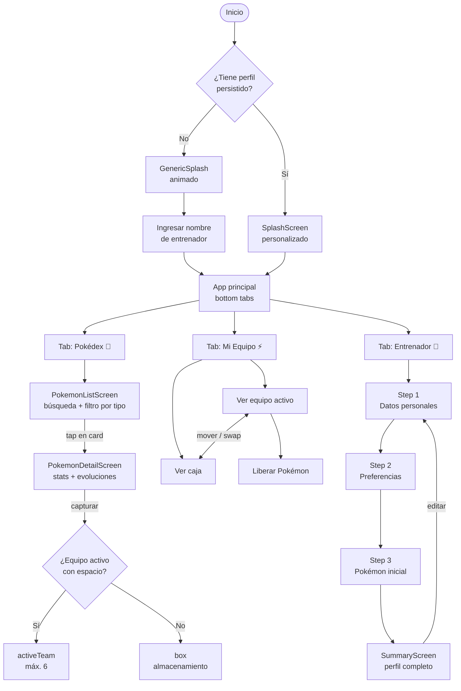

# Pokédex App


Aplicación móvil construida con React Native y Expo SDK 54 que combina una Pokédex interactiva con un sistema completo de registro de entrenador. Permite explorar la Pokédex, capturar Pokémon, gestionar tu equipo activo y caja, y construir tu perfil de entrenador mediante un wizard multi-paso.

---

## Instalar la app (Android)

Descarga directa del APK — no requiere login ni cuenta de Expo:

```
https://expo.dev/artifacts/eas/Bbv0pTrePrgHeaFm0PJPAz8DnV_vWA7ZWyNOZZXyWN4.apk
```

> Al instalar, Android pedirá activar **"Instalar de fuentes desconocidas"** — es normal para APKs distribuidos internamente.

---

## Funcionalidades

### Pokédex
- Lista infinita de Pokémon con scroll (20 por página, carga automática al llegar al final)
- Búsqueda en tiempo real por nombre
- Filtro por tipo (Fuego, Agua, Planta, Eléctrico, etc.) con 18 tipos disponibles
- Pantalla de detalle con estadísticas base, habilidades, descripción de especie y cadena de evolución completa
- Sistema de captura con animación de Pokéball y feedback háptico
- Indicador visual de Pokémon ya capturados directamente en la lista

### Mi Equipo
- Equipo activo de hasta 6 Pokémon con drag-and-drop conceptual
- Caja de almacenamiento ilimitada para Pokémon capturados
- Mover Pokémon individualmente entre equipo y caja
- Intercambio directo caja ↔ equipo (swap)
- Liberación de Pokémon con confirmación

### Registro de entrenador
- Wizard de 3 pasos: datos personales (nombre, edad, email) → preferencias (distrito, tipo favorito) → selección de Pokémon inicial
- Validación en tiempo real con errores inline que bloquean el avance
- Modo edición parcial: actualizar solo datos básicos o solo preferencias sin perder el Pokémon inicial
- Perfil persistido en AsyncStorage — sobrevive reinicios de la app
- Splash personalizado para entrenadores registrados

---

## Flujo de la aplicación



---

## Stack tecnológico

| Capa | Tecnología | Versión |
|---|---|---|
| Framework | Expo | 54.0.34 |
| UI nativo | React Native | 0.81.0 |
| Lenguaje | TypeScript (strict) | 5.5.4 |
| Navegación | React Navigation | 7.x |
| Estado global | Zustand + AsyncStorage | 5.0.2 |
| Datos remotos | TanStack Query | 5.62.3 |
| Formularios | react-hook-form + Yup | 7.53.2 + 1.4.0 |
| UI tokens | Tamagui | 2.4.0 |
| Animaciones | react-native-reanimated | ~4.1.1 |
| API externa | PokéAPI v2 | pública, sin auth |

---

## Arquitectura

Organización **feature-based**: cada funcionalidad es autónoma en `src/features/<nombre>/`.

```
src/
├── features/
│   ├── pokedex/          # Pokédex completa
│   │   ├── components/   # PokemonCard, PokemonStats, EvolutionChain, Skeletons…
│   │   ├── hooks/        # usePokemonList, usePokemonDetail, useEvolutionChain…
│   │   ├── screens/      # PokemonListScreen, PokemonDetailScreen
│   │   └── types/        # pokemon.types.ts
│   ├── trainer/          # Wizard de registro
│   │   ├── components/   # FormField, StepIndicator, TrainerCard
│   │   ├── hooks/        # useStarterPokemon
│   │   ├── schemas/      # step1Schema.ts, step2Schema.ts (Yup)
│   │   ├── screens/      # Step1, Step2, StarterPokemon, Summary
│   │   └── types/        # trainer.types.ts
│   └── team/             # Gestión del equipo
│       └── screens/      # TeamScreen
├── navigation/           # RootNavigator (tabs + swipe), stacks, types.ts
├── store/                # trainerStore.ts (Zustand + persist)
├── services/             # pokeApi.ts (wrappers fetch → PokéAPI)
├── components/ui/        # Button, EmptyState, ErrorState, Modales, SplashScreen…
├── constants/            # colors.ts, api.ts
└── utils/                # pokemonHelpers.ts
```

---

## Instalación y desarrollo

### Requisitos

- Node.js 18+
- npm 9+
- [Expo Go](https://expo.dev/go) en el dispositivo físico (Android o iOS)

### Pasos

```bash
# 1. Clonar e instalar
git clone <url-del-repositorio>
cd pokedex-app
npm install --legacy-peer-deps   # flag obligatorio por conflictos de peer deps

# 2. Iniciar el servidor de desarrollo
npx expo start

# 3. Escanear el QR con Expo Go (Android) o la app Cámara (iOS)
```

### Scripts disponibles

```bash
npm run typecheck        # Verificar tipos TypeScript (debe pasar limpio)
npm run lint             # ESLint sobre src/
npm run lint:fix         # ESLint con auto-fix
npm test                 # Tests (jest-expo + @testing-library/react-native)
npm run test:coverage    # Tests con reporte de cobertura
npm run validate         # typecheck + lint + test en secuencia
npm run doctor           # Verificar compatibilidad de dependencias (expo-doctor)
```

---

## Builds con EAS

```bash
# APK de preview para compartir (Android)
npm run build:android:preview

# Build de producción — App Bundle para Play Store
npm run build:android:prod

# Ver link de descarga del APK tras el build
eas build:view <build-id>   # → campo "Application Archive URL"

# OTA update sin rebuild
npm run update
```

| Perfil | Tipo de output | Distribución |
|---|---|---|
| `development` | APK con dev client | Interna |
| `preview` | APK instalable | Interna |
| `production` | App Bundle (AAB) | Play Store / App Store |

---

## Fuente de datos

Todos los datos de Pokémon provienen de [PokéAPI v2](https://pokeapi.co) — API pública, sin auth ni API key.

| Endpoint | Propósito |
|---|---|
| `GET /pokemon?limit=20&offset=N` | Lista paginada |
| `GET /pokemon/{id}` | Detalle, stats, sprites |
| `GET /type/{name}` | Filtro por tipo |
| `GET /pokemon-species/{id}` | Descripción y datos de especie |
| `GET /evolution-chain/{id}` | Cadena de evolución |

---

## Decisiones técnicas clave

| Decisión | Tecnología | Motivo |
|---|---|---|
| Paginación | `useInfiniteQuery` | Carga automática al final de `FlatList`, sin offset manual |
| Persistencia | Zustand + `persist` + AsyncStorage | Perfil y equipo sobreviven reinicios |
| Formularios | react-hook-form + `Controller` | Validación declarativa sin `register` HTML |
| Safe Area | `react-native-safe-area-context` | Requerido en Expo SDK 54 (deprecado en RN core) |
| Navegación swipe | `PanResponder` en cada tab | Transición entre tabs con gesto desde bordes de pantalla |
| Caché API | React Query `staleTime: 5 min` | Evita refetch innecesario al navegar entre pantallas |
