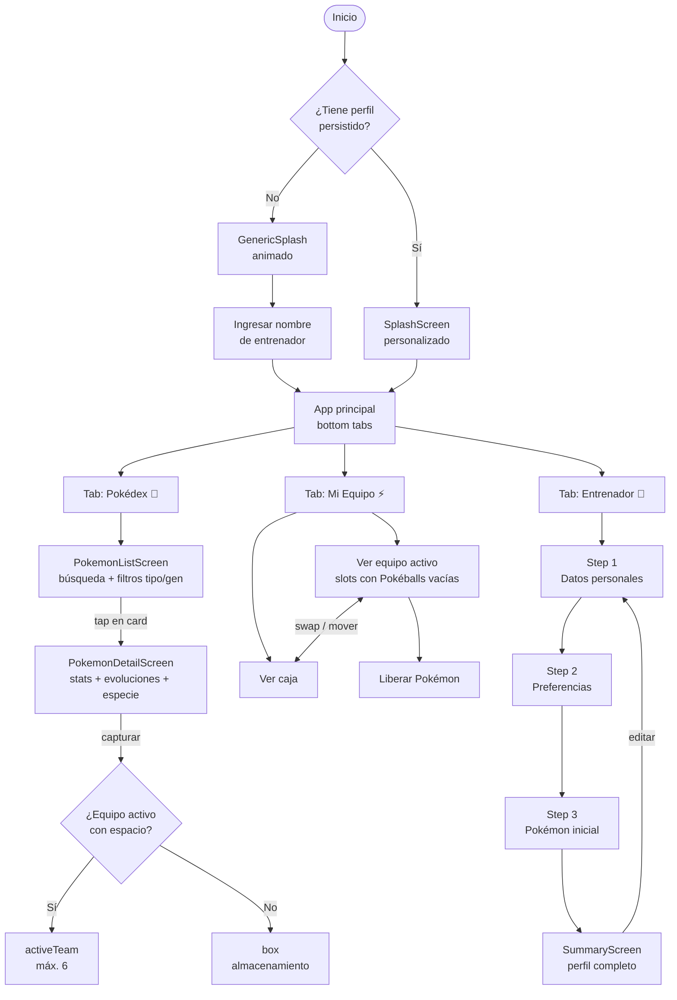

# Pokédex App


[](https://github.com/anyirodriguezu/pokedex-app/actions/workflows/eas-build.yml)

Aplicación móvil construida con React Native y Expo SDK 54 que combina una Pokédex interactiva con un sistema completo de registro de entrenador. Permite explorar la Pokédex, capturar Pokémon, gestionar tu equipo activo y caja, y construir tu perfil de entrenador mediante un wizard multi-paso.

---

## Demo

<p align="center">
  
</p>

---

## Instalar la app (Android)

| Opción | Link | Detalle |
|---|---|---|
| Descarga directa (repositorio) | **[Descargar APK](https://github.com/anyirodriguezu/pokedex-app/raw/master/releases/application-c3c2921b-1696-4cc0-aa12-3a1dda31a150.apk)** | APK incluido en el repositorio |
| Dashboard de Expo | **[expo.dev/.../builds](https://expo.dev/accounts/anyirodriguezu/projects/pokedex-app/builds)** | Siempre muestra las últimas versiones generadas — selecciona el build con perfil `preview` para descargar |

> Al instalar, Android pedirá activar **"Instalar de fuentes desconocidas"** — es normal para APKs distribuidos internamente.

> ⚠️ **Nota didáctica:** el APK está incluido en el repositorio únicamente para que el jurado del reto técnico pueda descargarlo directamente. En un proyecto real los binarios no se versionan en git — lo correcto es distribuirlos a través de la Play Store o un servicio como EAS o Firebase App Distribution.

---

## Funcionalidades

### Pokédex
- Lista infinita de Pokémon con scroll (20 por página, carga automática al llegar al final)
- Búsqueda en tiempo real por nombre con debounce de 400 ms
- Filtro por tipo (18 tipos: Fuego, Agua, Planta, Eléctrico, Psíquico, Normal, Lucha, Volador, Veneno, Tierra, Roca, Fantasma, Bicho, Dragón, Siniestro, Acero, Hielo, Hada)
- Filtro por generación (Gen 1 a Gen 9, Pokémon #1–#1025) combinable con el filtro por tipo
- Pantalla de detalle con estadísticas base, habilidades, descripción de especie (español/inglés), cadena de evolución completa, tasa de captura con nivel de dificultad (Muy fácil → Muy difícil), distribución de género y categoría de especie
- Selector de sprites alternativos (oficial, shiny, home) en la pantalla de detalle
- Sistema de captura con animación de Pokéball, efecto de escape y feedback háptico
- Aura visual sobre Pokémon ya capturados en la pantalla de detalle
- Indicador visual de Pokémon capturados directamente en la lista

### Mi Equipo
- Equipo activo de hasta 6 Pokémon con slots vacíos visuales tipo Pokéball
- Caja de almacenamiento ilimitada para Pokémon capturados
- Mover Pokémon individualmente del equipo a la caja (MoveToBoxModal)
- Máquina de transferencia (TransferMachineModal) con gestos de arrastre para mover Pokémon de la caja al equipo o hacer swap directo
- Liberación de Pokémon con confirmación (ReleaseModal) y animación de efecto
- Manejo automático cuando el equipo está lleno (TeamFullModal): el Pokémon capturado va directo a la caja

### Registro de entrenador
- Wizard de 3 pasos: datos personales (nombre, edad, email) → preferencias (distrito, tipo favorito) → selección de Pokémon inicial
- Validación en tiempo real con errores inline que bloquean el avance
- Modo edición parcial: actualizar solo datos básicos o solo preferencias sin perder el Pokémon inicial
- Perfil persistido en AsyncStorage — sobrevive reinicios de la app
- Splash personalizado para entrenadores registrados con nombre y datos del perfil

---

## Flujo de la aplicación



---

## Stack tecnológico

| Capa | Tecnología | Versión |
|---|---|---|
| Framework | Expo | 54.0.34 |
| UI nativo | React Native | 0.81.0 |
| Lenguaje | TypeScript (strict) | 5.5.4 |
| Navegación | React Navigation | 7.x |
| Estado global | Zustand + AsyncStorage | 5.0.2 |
| Datos remotos | TanStack Query | 5.62.3 |
| Formularios | react-hook-form + Yup | 7.53.2 + 1.4.0 |
| UI tokens | Tamagui | 2.4.0 |
| Animaciones | react-native-reanimated | ~4.1.1 |
| Haptics | expo-haptics | ~15.0.8 |
| API externa | PokéAPI v2 | pública, sin auth |

---

## Arquitectura

Organización **feature-based**: cada funcionalidad es autónoma en `src/features/<nombre>/`.

```
src/
├── features/
│   ├── pokedex/          # Pokédex completa
│   │   ├── components/   # PokemonCard, PokemonStats, PokemonEvolutionChain,
│   │   │                 # CaptureEffect, CapturedAura, EscapeEffect, ReleaseEffect,
│   │   │                 # PokemonListSkeleton, PokemonDetailSkeleton, LoadingState
│   │   ├── hooks/        # usePokemonList, usePokemonDetail, usePokemonSpecies,
│   │   │                 # useEvolutionChain, usePokemonTypeFilter (tipos + generaciones)
│   │   ├── screens/      # PokemonListScreen, PokemonDetailScreen
│   │   └── types/        # pokemon.types.ts
│   ├── trainer/          # Wizard de registro
│   │   ├── components/   # FormField, StepIndicator, TrainerCard
│   │   ├── constants/    # typeEmoji.ts
│   │   ├── hooks/        # useStarterPokemon
│   │   ├── schemas/      # step1Schema.ts, step2Schema.ts (Yup)
│   │   ├── screens/      # Step1PersonalDataScreen, Step2PreferencesScreen,
│   │   │                 # StarterPokemonScreen, SummaryScreen
│   │   └── types/        # trainer.types.ts
│   └── team/             # Gestión del equipo
│       └── screens/      # TeamScreen
├── hooks/                # usePokemonSearch (debounce 400 ms, cross-feature)
├── navigation/           # RootNavigator (tabs + swipe PanResponder),
│                         # PokedexStack, TrainerStack, TeamStack, types.ts
├── store/                # trainerStore.ts (Zustand + persist + rehydration)
├── services/             # pokeApi.ts (fetch wrappers → PokéAPI v2)
├── components/ui/        # Button, EmptyState, ErrorState, SplashScreen,
│                         # TrainerNameInputScreen, PokeballIcon,
│                         # ReleaseModal, MoveToBoxModal, TeamFullModal,
│                         # TransferMachineModal
├── constants/            # colors.ts, api.ts
├── utils/                # pokemonHelpers.ts
└── __mocks__/            # tamagui.tsx, @tamagui/config.ts (mocks para tests)
```

---

## Instalación y desarrollo

### Requisitos

- Node.js 18+
- npm 9+
- [Expo Go](https://expo.dev/go) en el dispositivo físico (Android o iOS)

### Pasos

```bash
# 1. Clonar e instalar
git clone <url-del-repositorio>
cd pokedex-app
npm install --legacy-peer-deps   # flag obligatorio por conflictos de peer deps de React 19

# 2. Iniciar el servidor de desarrollo
npx expo start

# 3. Escanear el QR con Expo Go (Android) o la app Cámara (iOS)
```

### Scripts disponibles

```bash
# Desarrollo
npm start                # Iniciar servidor de desarrollo
npm run start:clear      # Iniciar limpiando caché
npm run android          # Abrir en emulador/dispositivo Android
npm run ios              # Abrir en simulador/dispositivo iOS

# Calidad de código
npm run typecheck        # Verificar tipos TypeScript (debe pasar limpio)
npm run typecheck:watch  # Verificar tipos en modo watch
npm run lint             # ESLint sobre src/
npm run lint:fix         # ESLint con auto-fix
npm run validate         # typecheck + lint + test en secuencia

# Tests
npm test                 # Tests (jest-expo + @testing-library/react-native)
npm run test:watch       # Tests en modo watch
npm run test:coverage    # Tests con reporte de cobertura

# Mantenimiento
npm run doctor           # Verificar compatibilidad de dependencias (expo-doctor)
npm run deps:check       # Verificar versiones de dependencias nativas
npm run prebuild         # Generar código nativo (android/ e ios/)
npm run prebuild:clean   # Regenerar código nativo desde cero
```

---

## Tests

El proyecto incluye 31 archivos de test con cobertura sobre las capas principales:

| Área | Archivos cubiertos |
|---|---|
| Pantallas | PokemonListScreen, PokemonDetailScreen, TeamScreen, Step1, Step2, StarterPokemon, SummaryScreen |
| Hooks | usePokemonList, usePokemonDetail, usePokemonTypeFilter, usePokemonSearch |
| Componentes | PokemonEvolutionChain, CaptureEffect, EscapeEffect, ReleaseEffect, CapturedAura |
| Componentes UI | Button, EmptyState, ErrorState, SplashScreen, TrainerNameInputScreen, TransferMachineModal |
| Servicios | pokeApi (fetch wrappers) |
| Store | trainerStore (captura, equipo, caja, persistencia) |
| Schemas | step1Schema, step2Schema (validaciones Yup) |
| Utils | pokemonHelpers |

```bash
npm test                 # Ejecutar todos los tests
npm run test:coverage    # Ver informe de cobertura por archivo
```

---

## Builds con EAS

```bash
# Android
npm run build:android:preview    # APK instalable para compartir
npm run build:android:prod       # App Bundle para Play Store

# iOS
npm run build:ios:preview        # Build de preview para TestFlight/AdHoc
npm run build:ios:prod           # Build de producción para App Store

# Todas las plataformas
npm run build:all                # Production build para Android e iOS

# Ver link de descarga tras el build
eas build:view <build-id>        # → campo "Application Archive URL"

# OTA update sin rebuild
npm run update                   # Canal detectado automáticamente
npm run update:preview           # Canal preview
npm run update:prod              # Canal production

# Publicar en stores
npm run submit:android
npm run submit:ios
```

| Perfil | Tipo de output | Distribución |
|---|---|---|
| `development` | APK/IPA con dev client | Interna |
| `preview` | APK instalable | Interna |
| `production` | App Bundle / IPA | Play Store / App Store |

---

## CI/CD

El repositorio incluye un workflow de GitHub Actions en `.github/workflows/eas-build.yml` que se ejecuta automáticamente en cada Pull Request hacia `master`.

### Android Preview Build

| Step | Acción |
|---|---|
| `actions/checkout@v4` | Clona el repositorio |
| `actions/setup-node@v4` | Node.js 20 con caché npm |
| `npm install --legacy-peer-deps` | Instala dependencias |
| `npm install -g eas-cli` | Instala EAS CLI |
| `eas build --platform android --profile preview` | Dispara build en la nube de Expo usando `EXPO_TOKEN` |

El APK generado queda disponible en el dashboard de Expo:
[expo.dev/.../builds](https://expo.dev/accounts/anyirodriguezu/projects/pokedex-app/builds)

> El build de iOS está declarado en el workflow pero deshabilitado — requiere cuenta de Apple Developer y certificados configurados en EAS.

---

## Fuente de datos

Todos los datos de Pokémon provienen de [PokéAPI v2](https://pokeapi.co) — API pública, sin auth ni API key.

| Endpoint | Propósito |
|---|---|
| `GET /pokemon?limit=20&offset=N` | Lista paginada |
| `GET /pokemon/{id}` | Detalle, stats, sprites, habilidades |
| `GET /type/{name}` | Filtro por tipo (18 tipos) |
| `GET /pokemon-species/{id}` | Descripción, género, tasa de captura, generación |
| `GET /evolution-chain/{id}` | Cadena de evolución completa |

---

## Decisiones técnicas clave

| Decisión | Tecnología | Motivo |
|---|---|---|
| Paginación | `useInfiniteQuery` | Carga automática al final de `FlatList`, sin offset manual |
| Persistencia | Zustand + `persist` + AsyncStorage | Perfil y equipo sobreviven reinicios |
| Formularios | react-hook-form + `Controller` | Validación declarativa sin `register` HTML |
| Safe Area | `react-native-safe-area-context` | Requerido en Expo SDK 54 (`SafeAreaView` de RN core deprecado) |
| Navegación swipe | `PanResponder` en cada tab | Transición entre tabs con gesto desde bordes de pantalla (32 px) |
| Gestos de transferencia | `PanResponder` en TransferMachineModal | Arrastre de Pokémon de la caja al equipo con animación |
| Caché API | React Query `staleTime: 5 min` | Evita refetch innecesario al navegar entre pantallas |
| Búsqueda | debounce 400 ms en `usePokemonSearch` | Evita peticiones por cada tecla pulsada |
| Rehydration | `persist.onFinishHydration()` en AppShell | Garantiza que AsyncStorage esté listo antes de montar la UI |
